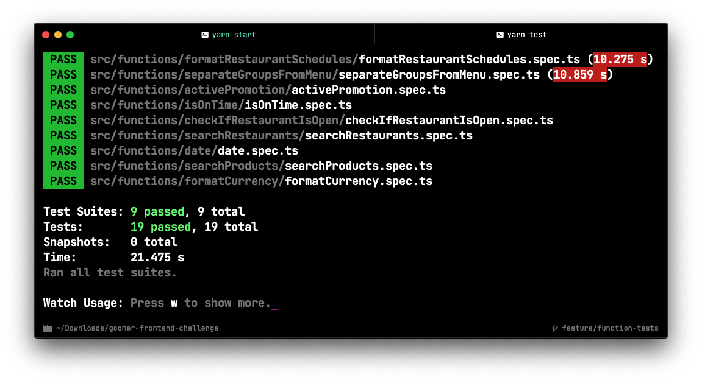

<div>
  
  
</div>


<h1 align="center">Goomer Lista Rango</h1>

<p align="center">Uma aplicação Web responsiva desenvolvida com <a href="https://create-react-app.dev/">create-react-app</a> que consulte a API da empresa <a href="https://github.com/goomerdev">Goomer</a> e exibe uma lista de restaurantes e o cardápio de cada um deles.</p>

<p align="center">
 <a href="#features">Features</a> •
 <a href="#-tecnologias">Tecnologias</a> •
 <a href="#arquitetura">Arquitetura</a> •
 <a href="#testes">Testes</a> •
 <a href="#como-usar">Como usar</a> •
 <a href="#desafios">Desafios</a> •
 <a href="#melhorias">Melhorias</a> •
</p>

<h4 align="center">
	 Status: Teste entregue!
</h4>

---

### Features

#### Home
- [x] Listar restaurantes.
- [x] Buscar por um ou mais restaurantes.
- [x] Exibir restaurantes abertos e fechados sem a necessidade de recarregar ou reabrir a página.

#### Estabelecimento
- [x] Exibir o nome, a imagem, o endereço e o horário de funcionamento do restautante caso exitam

- [x] Listar cardárpio do restaurante.
- [x] Buscar por um ou mais produtos do cardápio.
- [x] Exibir o nome, a imagem, o valor e uma descrição do produto caso existam.
- [x] Para os produtos com promoção ativa, deve ser exibibo o valor original e o valor promocional.
- [x] As promoções ativas e o valor promocional devem ser atualizados na interface de acordo com o horário, sem a necessidade de recarregar ou reabrir a página.
- [x] Quando o usuário clicar em um produto, abrir um modal exibindo as informações desse produto e opções de adicionar e remover quantidades desse produto, exibir também o valor original e o valor total com base na quantidade de produtos selecionados.

#### Outros
- [x] Testes unitários nas principais funções do projeto.
- [x] Adicionado botão de voltar caso o usuário não esteja na Home.

---
### Tecnologias

As seguintes ferramentas foram usadas na construção do projeto:

- [React](https://pt-br.reactjs.org/)
- [Node.js](https://nodejs.org/en/)
- [TypeScript](https://www.typescriptlang.org/)

#### Auxiliares
- [Axios](https://github.com/axios/axios)
- [Date-fns](https://date-fns.org/)
- [React Redux](https://react-redux.js.org/)
- [React Modal](https://www.npmjs.com/package/react-modal)
- [React Router Dom](https://reactrouter.com/web/guides/quick-start)
- [Styled components](https://styled-components.com/)

#### Padronização de código/commits:
- [ESLint](https://eslint.org/)
- [Prettier](https://prettier.io/)
- [Commitizen](https://www.npmjs.com/package/commitizen)

---

### Arquitetura
```shell
src/
|-- assets/ # Contém todos os assets da aplicação.
|-- components/ # Contém os components reutilizáveis do projeto.
|-- function/ # funções globais, que podem ser reutilizadas.
|-- pages/ # Todas as páginas do projeto estão dentro dessa pasta.
|-- routes/ # Arquivos de roteamento.
|-- services/ # Arquivos de configurações de requisições a API.
|-- store/ # Arquivos dos estados globais da aplicação, onde estão todas as regras do Redux.
|-- styles/ # Contém todos os arquivos relacionados a padronização de estilos do projeto.
```

---

### Testes



##### Execute o comando a seguir para rodar os testes unitários
```bash
yarn test
```

### Como usar
#### Pré-requisitos

Antes de começar, você vai precisar ter instalado em sua máquina as seguintes ferramentas:
[Git](https://git-scm.com), [Node.js](https://nodejs.org/en/), [yarn](https://yarnpkg.com/) ou [npm](https://www.npmjs.com/package/npm).

Além disto é bom ter um editor para trabalhar com o código como [VSCode](https://code.visualstudio.com/) [](https://open.vscode.dev/Naereen/badges)

##### Clone este repositório
```bash
git clone https://github.com/fernando-meira/goomer-frontend-challenge.git
```
##### Acesse a pasta do projeto no terminal/cmd
```bash
cd goomer-frontend-challenge
```
##### Instale as dependências com yarn ou npm
```bash
yarn
# ou npm install
```
##### Execute a aplicação em modo de desenvolvimento
```bash
yarn start
```
#### O servidor inciará na porta:3000 - acesse <http://localhost:3000>

---

### Desafios
<p> Sem dúvidas a feature mais complexa foi a de tratamento dos horários dos restaurantes e dos valores promocionais, as informações terem de ser atualizadas em tela sem o recarregamento também foi desafiador.</br>
Para o gerenciamento de estados globais da aplicação utilizei o <a href="https://react-redux.js.org/">Redux</a>, normalmente utilizo a <a href="https://pt-br.reactjs.org/">Context API</a>, mas queria me testar e apesar de não ter o domínio da ferramenta a implementação foi bem-sucedida. Outro ponto foram os testes unitários, até esse projeto eu não tinha tido contato, apesar de não implementar nos componentes consegui nas principais funções.
</p>

---

### Melhorias
<p>Uma melhoria na aplicação seria a implementação dos testes unitários nos componentes utilizando <a href="https://jestjs.io/pt-BR/">Jest</a> combinado com <a href="https://testing-library.com/">Testing Library
</a> para evitar erros que não foram previstos durante o desenvolvimento, outro ponto a ser revisto é o tratamento de erros, hoje está sendo feito através do <i>throw new error</i>, poderia ser adicionado um toast ou um alert para notificação ao usuário. Relacionado a performance, poderiamos migrar o projeto de CRA para <a href="https://nextjs.org/">Next.js</a>, com isso ganhariamos desempenho graças as páginas server side rendering e static site generator que a ferramenta oferece, e ainda teriamos um melhor gerenciamento de SEO.</p>

---

<p>Feito com muita dedicação, empenho e carinho! Agradeço de coração a <a href="https://github.com/goomerdev">Goomer</a> pela oportunidade!</p>

[](http://ForTheBadge.com)


